We will assume that you complete all steps labeled **`pre-requisite`** and  you are creating a project with the following ID:

    $PROJECT_ID = sydecar-scratch-dev

 1. **`pre-requisite`** Create an empty project with $PROJECT_ID 
    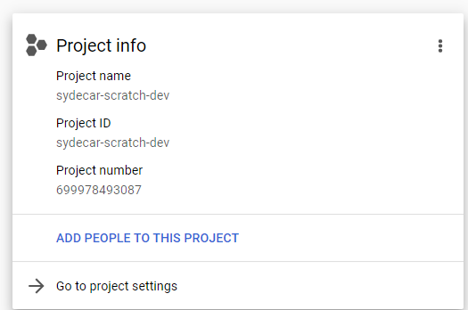
 
 
 2. **`pre-requisite`** Enable **Compute API** (compute.googleapis.com) and **Secret Manager API** (secretmanager.googleapis.com). Wait for these to complete before proceeding.

    
 
 
 3. **`pre-requisite`** Create a bucket named `$PROJECT_ID-tf` with all defaults (ideally only Terraform needs access)
    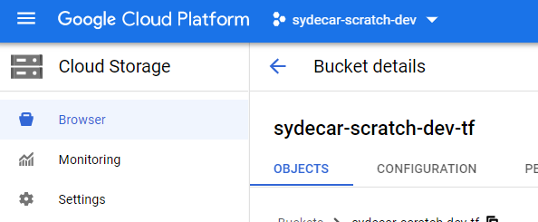

 
 4. **`pre-requisite`** Connect the appropriate repository by opening Cloud Build or clicking [here](https://console.cloud.google.com/cloud-build/repos?cloudshell=false). This repository should be same as what is defined in 📁*terraform/env/dev/variables.tf*. The build triggers will expect to pull the cloud run apps from here.

    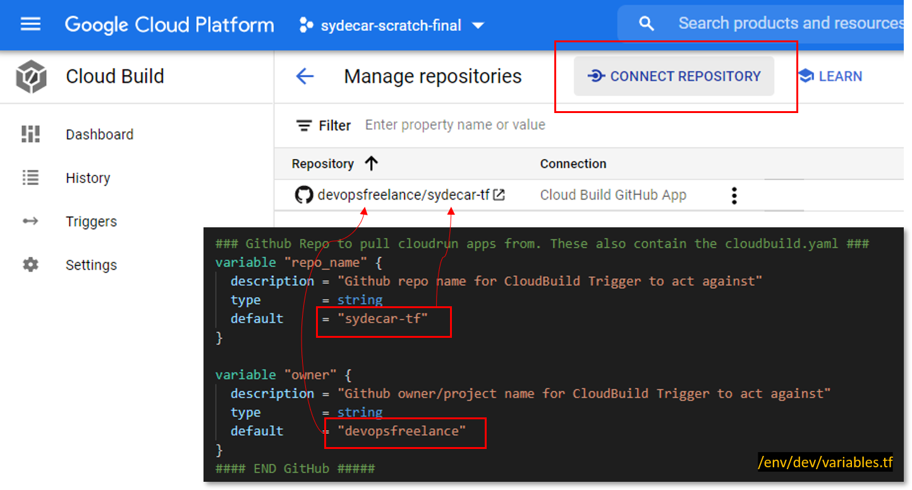
 
 
 5. Open Google console Cloud Shell and **clone the GIT repo**.
    
    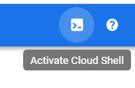
 
 
 6. Edit 📁*terraform/env/dev/variables.tf* and update section `"gcp_project_id"` with `$PROJECT_ID`
    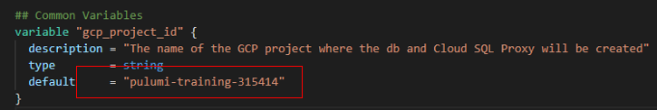
 
 
 7. Edit 📁*terraform/env/dev/backend.tf* and update bucket to `$PROJECT_ID-tf` (the bucket you made in step 3)
    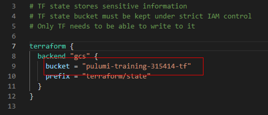
 
 
 8. Ensure current project is set to `$PROJECT_ID` by issuing `gcloud config set project $PROJECT_ID` 
    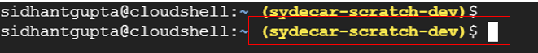

 
 9. For each app (two in this example code), we will build the image by calling `gcloud build` and uploading the resulting image to GCP. Execute the following from repo root dir. Say "y" to if prompted to enable cloudbuild API:
	  -  `(cd apps/python-hello/ && chmod +x build.sh && ./build.sh)`
	  - `(cd apps/pythondb/ && chmod +x build.sh && ./build.sh)`

	You can verify if the images were successfully pushed by opening Container Registry in GCP UI.
    

 
 10. You can now run Terraform environment.
	 -  `cd terraform/envs/dev`
	 -  `terraform init`

     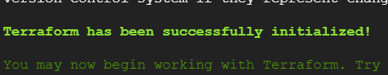

	 - `terraform plan`

     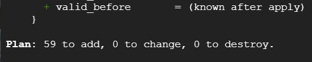
	
	 - `terraform apply`

     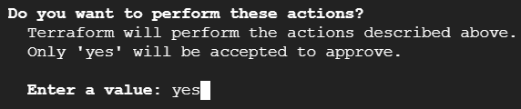
	
		Respond yes when prompted. Can be made silent with flag `-auto-approve`

		Grab an espresso ☕. This will take a while.. especially the postgres setup takes ~10 minutes. Total time about 20 minutes. When done, you should see "Apply complete!"

     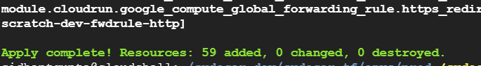

	 - You can list the external Load Balancer IP, and test the two  deployed services at [http://<external_ip>/hello](http://%3cexternal_ip%3e/hello) and [http://<external_ip>/pythondb](http://%3cexternal_ip%3e/pythondb)  
     *Note: It may take a few minutes for all service to come up. It is normal to see internal server errors, 404s or DB comm erros in logs for the first ~3-5 minutes.*

	 `gcloud compute addresses list`

     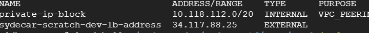

### Known Issues
If you see errors of this form (it can randomly complaint in a different module):  

> Error: Error when reading or editing SecretManagerSecret
> "projects/$PROJECT_ID/secrets/postgres-username-pwd": Get
> "[https://secretmanager.googleapis.com/v1/projects/sydecar-scratch-final/secrets/postgres-username-pwd?alt=json](https://secretmanager.googleapis.com/v1/projects/sydecar-scratch-final/secrets/postgres-username-pwd?alt=json)":
> dial tcp [2607:f8b0:400e:c08::5f]:443: connect: cannot assign
> requested address

the resolution is to to execute terraform from a machine that does *not* have IPV6 enabled. GCP shell by default does, so **it is recommended to turn it off** by following the commands below. We have found sometimes, simply re-running `terraform apply` will make it go away.

Reference: [https://github.com/hashicorp/terraform-provider-google/issues/6782](https://github.com/hashicorp/terraform-provider-google/issues/6782)  

**Machine on which terra form is being executed, disable ipv6**

    sysctl  net.ipv6.conf.all.disable_ipv6  
    net.ipv6.conf.default.disable_ipv6 = 1

**Run this script in your GCP cloud shell**

    #!/bin/bash
    export APIS="googleapis.com www.googleapis.com storage.googleapis.com iam.googleapis.com container.googleapis.com cloudresourcemanager.googleapis.com"
    for i in $APIS
    do
    	echo "199.36.153.10 $i" >> /etc/hosts
    done

Reference: https://stackoverflow.com/questions/62106154/frequent-error-when-deploying-helm-to-gke-with-terraform

### Recommended Improvements

 1. Create one central GCP Project with a Cloud Storage bucket as the only resource. This bucket will hold terraform state information from all the other projects in the company. Access to this project id carefully guarded.
 2. Currently Terraform code does not manage IAM permission and these are done out-of-band. Recommended that you maintain IAM policies/role through Terraform for ease of management, consistency, reliability and change history.
 3. Keep GCP Console UI as read only. This will prevent accidental changes and will force changes either via command line or via Terraform.
 4. Currently one `cloudbuild.yaml` is needed per `apps/*` project. Instead, a single `cloudbuild.yaml` template with environment variables can be installed in the root `app/` and each build trigger can be configured to "rewrite environment variables" (under Triggers > trigger > Advanced > Substitution variables). That is, at runtime, the build process would populate the variables with project name, app name, etc. This would avoid developers managing the cloudbuild.yaml and bring consistency to operations.
 5. Bastion host VM in GCP UI exposes the service account private key since it shows the startup script in UI. Resolution is to write a small app or a python script that uses GCP librarires to instead use ADC (Application Default Credentials) mechanism to securely pull the key from a bucket and load into the bastion host environment. This is only an issue if the UI can be accessed by a borader audience in the company. There are two potential resolutions:
    - A python script instead of a bash script. Python script would use google-auth libraries ensuring no secrets are visible anywhere.
    - Once Terraform builds the image (with bash script and key visible in UI), manually create a snapshot of this VM to create another. Since the  VM has already initialized with private key, the snapshot can spawn a VM that is all ready to go. Destroy the original VM using Terraform using:
    `terraform destroy -target module.dbproxy.google_compute_instance.db_proxy `
